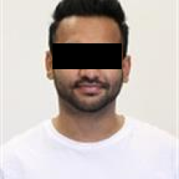
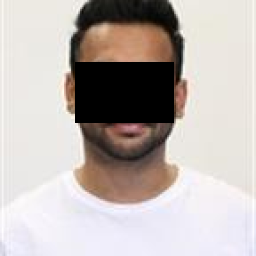
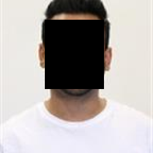
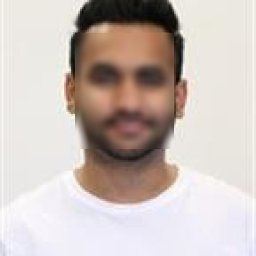
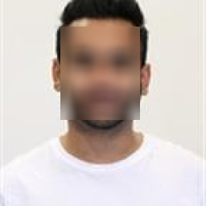
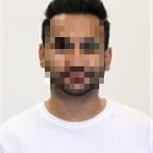
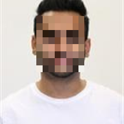
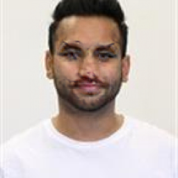

# Face-Anonymization

This project aims to provide a setup for anomaly detection in Networking, specifically to detect DDoS attacks

<summary>Table of Contents</summary>

- [Face-Anonymization](#face-anonymization)
  - [Introduction](#introduction)
  - [Setup](#setup)
    - [1. Requirements](#1-requirements)
    - [2. Run the images via tool-box.](#2-run-the-images-via-tool-box)
  - [Results](#results)
  - [Future Work](#future-work)


## Introduction

Protect your Face in the Web – An Application of the Avira Anonymization Cloud

Everyone is sharing photos on the web, social media, or messaging services. It allows others to be part of your life. With Avira's Face Anonymization toolbox your face is now protected of being automatically recognized by unauthorized third parties without your knowledge and permission.

A recent New York times article describes a company that downloaded 3 billion photos from the web and used them to build a face recognition service that can detect and track citizen in the web. The photos were used without the owners' knowledge and permission. As a direct impact, the people visible in the photos are now recognizable by an AI and therefore trackable in future photos and videos shared on the web. The end of your privacy. And this is not the only company doing this.

Avira's Face Anonymization App is a simple solution that limits makes it impossible for state-of-the-art face recognition services to recognize your face. Install the app and every photo will automatically be protected. In addition, as technology advances and better face recognition services are being developed, we keep track of your anonymized photos and warn you once your face is recognizable again.

This app is powered by the Avira Anonymization Cloud (AAC). The AAC is a cloud service that anonymizes your personal information in such a way that it is not recognizable for the human senses but poisonous for artificial intelligences. AAC provides protection not only for your images but also for your videos, speech, and, written text. 


## Setup
### 1. Requirements

The toolbox is designed to be setup easily, simply follow the instructions below:

Open a shell/command prompt and paste below commands.

```shell
git clone https://github.com/AkhilSinghRana/Face-Anonymization.git

cd Face-Anonymization/ 

virtualenv env_name -p python3 #optional but recommended (creates a virtual python3 environment for the dependencies.)

source env_name/bin/activate #for linux and macOS (activates the virtual environment created above, exclude the command if you have not created the virtual environment, and want to setup the toolbox for your system-wide python)


pip install -e . #Installs the dependencies and creates a module for the toolbox

 ```

Note*- The above code will setup all the required dependencies for you. Tested only on Linux and macOS


You are now ready to enjoy the toolbox

### 2. Run the images via tool-box.

```shell
  # Easy and simple command
  python main.py --input_dir ../data/input-images-to-be-anonymized/ --output_dir ../data/Anonymized-Results/
  # Above commands run the images inside a directoty to all the methods and different modes available in the toolbox and saves the anonymized images inside a directory that you specify with --output_dir parameter
  
  ## for Advanced users 
  # run main file with help parameter to see all the options available
  # you can run individual methods if you like and also have option to run specific anonymization mode
  python main.py --help

  #Sample Output:
  usage: main.py [-h] [--input_dir INPUT_DIR]
               [--input_dir_known_faces INPUT_DIR_KNOWN_FACES]
               [--output_dir OUTPUT_DIR] [-t THRESHOLD] [-bm BLUR_MODE]
               [-pm PIXELATION_MODE] [-boxm BLACK_BOX_MODE] [--gpu GPU]
               [--mode MODE] [--feature-extractor FEATURE_EXTRACTOR] [--th TH]
               [--max-step MAX_STEP] [--sd SD] [--lr LR]
               [--batch-size BATCH_SIZE] [--separate_target] [--no-align]
               [--debug] [--format FORMAT]

  optional arguments:
    -h, --help            show this help message and exit
    --input_dir INPUT_DIR
                          Directory where the images that needs to be anonymized
                          are present
    --input_dir_known_faces INPUT_DIR_KNOWN_FACES
                          Directory where the images of known persons are
                          present, this creates a database of known persons for
                          facial recognition tool, by default same directory as
                          input directory is choosen
    --output_dir OUTPUT_DIR
                          Directory where the anonymized images will be save
    -t THRESHOLD, --threshold THRESHOLD
                          Face detection confidence
    -bm BLUR_MODE, --blur_mode BLUR_MODE
                          Options for different level of blurring, selection -->
                          min, mid , high, all
    -pm PIXELATION_MODE, --pixelation_mode PIXELATION_MODE
                          Options for different level of pixelation same as blur
                          modes
    -boxm BLACK_BOX_MODE, --black_box_mode BLACK_BOX_MODE
                          Options for different level of blackbox selection -->
                          top, bottom, complete, all
    --gpu GPU, -g GPU     the GPU id when using GPU for optimization
    --mode MODE, -m MODE  cloak generation mode, select from min, low, mid,
                          high. The higher the mode is, the more perturbation
                          added and stronger protection
    --feature-extractor FEATURE_EXTRACTOR
                          name of the feature extractor used for optimization,
                          currently only support high_extract
    --th TH               only relevant with mode=custom, DSSIM threshold for
                          perturbation
    --max-step MAX_STEP   only relevant with mode=custom, number of steps for
                          optimization
    --sd SD               only relevant with mode=custom, penalty number, read
                          more in the paper
    --lr LR               only relevant with mode=custom, learning rate
    --batch-size BATCH_SIZE
                          number of images to run optimization together
    --separate_target     whether select separate targets for each faces in the
                          directory
    --no-align            whether to detect and crop faces
    --debug               turn on debug and copy/paste the stdout when reporting
                          an issue on github
    --format FORMAT       format of the output image
```


## Results

Below are the results for the input image that was run through all the different methods and modes currently available in this tool box.

Input Image:

 

|Method | Parameter| Low| Mid| High|
|----------------|------------|------------|------------|------------|
|Masking| Size of the Black Box|  |  | |
|Blurring| Amount of Blur|  |  | |
|Pixelation| Pixel- Size|  |  | |
|Cloaking| Purturbation parameter|  |  | |

         

## Future Work

- Adding and integrating first-order-model.
 
- Adding and training more deep learning based models for anonymizing, e.g deep fakes, deep-dream

- Making toolbox work on a video stream

- Maybe a GUI will be created for ease of use